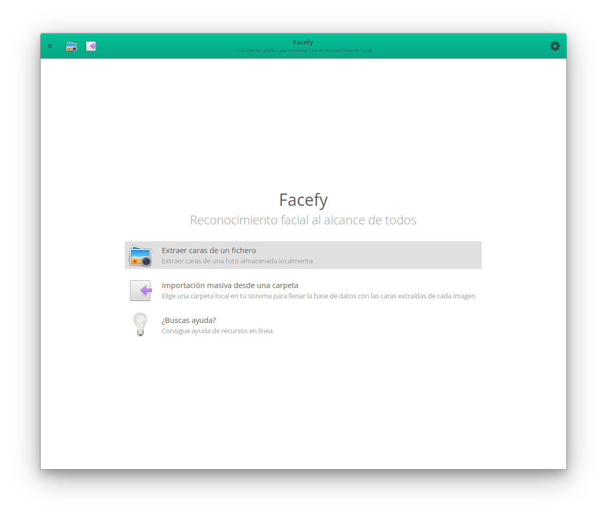

# Facefy

This is a template repository to ease the process of creating GUI with Vala based on GTK and Granite.



## Installation

The application is stored in my own Flatpak Repository but has some dependencies linked to the Gnome and Elementary environment which can be downloaded from Flathub.

Thus, make sure that

Then, add the two remotes: the `flathub` one to download the dependencies from and the `febrehub` which stores the application itself. This can be done using the following commands. 

```
flatpak remote-add --if-not-exists flathub https://dl.flathub.org/repo/flathub.flatpakrepo
flatpak remote-add --if-not-exists febrehub https://felixbrezo.com/febrehub.flatpakrepo
```

The aforementioned commands will require `root` permissions to add the remotes, but they can also be installed for the current system using `--user`.

Once added the repos, use the following to install:

```
flatpak install febrehub com.felixbrezo.Facefy
```

## Run it

And visit your applications menu or type the following to run:

```
flatpak run com.felixbrezo.Facefy 
```

## Hacking

For working with the application locally, check the [`HACKING.md`](doc/HACKING.MD) file.

