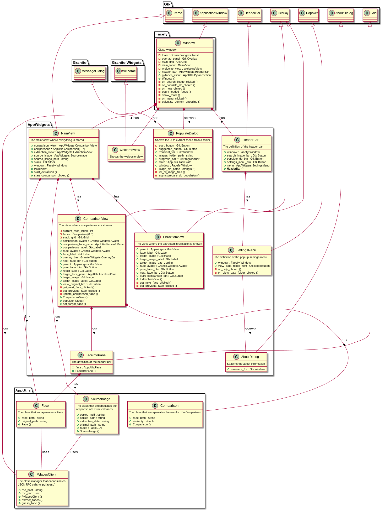

# Hacking the application

This file is intended to help hackers on building new features.

## Required dependencies

You'll need the following dependencies:

* granite >= 0.5
* meson >= 0.43.0
* valac

## Class diagrams



## Manual builds

## Towards building the application manually: the `build` folder

First of all, let's test it using `git clone`.

```
git clone https://github.com/febrezo/Facefy.git
cd Facefy
```


The `build` folder is not there by default but it is the place where things will be compiled. When testing our app we will be working many times from this path.

To create it, tell meson to do so:

```
meson build --prefix=/usr
```

However, it will not work if you follow the instracutions. Have a look at the error: is something wrong with the `en.po` file? That's related with translations. We will fix it now.

### Localize your application to different languages: the `po` folder

The `po` folder contains the information needed to localize the application:

- `LINGUAS`. A simple textfile which defines the languages to be used. In the template, `en`, `es` and `ca` are added one per line. Feel free to add new ones here.
- `meson.build`. It's a different file from the one in the base folder. It simply tells how to launch the `i18n` framework. Note that the `subdir('po')` clause in the main `meson.build` file redirects to the `meson.build` file inside the `po` directory.
- `POTFILES`. Contains the paths of the source files. They will be inspected to find any `_("Whatever")` string that will need to be localized.

Once understood, it's time to localize the application by building the templates for each language. Inside the `build` folder, run this command to build the empty internationalization template:

```
ninja com.felixbrezo.Facefy-pot
```

And this to update a new `.po` file within the previously created template for each language specified in the `LINGUAS` file:

```
ninja com.felixbrezo.Facefy-update-po
```

It's now yout turn to explore the contents and update the translations if you want it. For example, this is an example of two translated strings from the `es.po` file.

```
…
#: data/com.felixbrezo.Facefy.desktop.in:5
#: data/com.felixbrezo.Facefy.appdata.xml.in:7
msgid "Just another template"
msgstr "Simplemente otra plantilla"

#: data/com.felixbrezo.Facefy.desktop.in:6
msgid "A template for developing new Vala applications"
msgstr "Una plantilla para desarrollar nuevas aplicaciones en Vala"
…
```

There is an important note if you use non-ASCII characters. Edit this line:

```
"Content-Type: text/plain; charset=ASCII\n"
```

To look like this:

```
"Content-Type: text/plain; charset=UTF-8\n"
```

Otherwise, you may find errors when running the `ninja com.felixbrezo.Facefy-update-po` command.


### Provide additional metadata for the launcher: the `data` folder

The `.desktop.in` file is the template for the `.desktop` file which is used for the icon that is placed in the applications menu. The `.appdata.xml.in` file is the template for the description in the elementary OS application store. The text found in the file is also grabbed by the i18n package.

This folder contains a new `meson.build` which is in charge of generating the final files and install these elements in the system. Note that the `subdir('data')` clause in the main `meson.build` file redirects here.

### Testing the application

Once understood, it's time to build the application from the `build` folder and test it:

```
ninja
./com.felixbrezo.Facefy
```

If you want to install it, try:

```
sudo ninja install
```

The application will be ready to use in your system from your applications menu thanks to `desktop` file provided under the `data` folder or even using the terminal (note the absence of the `./` since the application is now installed):

```
com.felixbrezo.Facefy
```

### Automatic name customization: the `bin` folder

Once tested, you can customize the name of the application using the Python script found under `bin`.

```
cd bin
```

You will need Python in your system to use it. It will require a RDNN identifier for the application in the form of `com.github.febrezo.MyApp` or `com.felixbrezo.MyApp`. The script will automatically go through all the given files found inside and adapt them to that RDNN name.

It's strongly recommended to test it then and save the commit.


### Edit your code: the `src` folder

Code SHOULD be added under the `src` folder. Note that the compilation is made using the `meson.build` file under the project root so it is very important to add each new file added in that file. For example, if a new file is added as `src/gui/MyDialog.vala` it is required to add it as follows:

```
…
executable(
  meson.project_name(),
  'src/Application.vala',
  'src/Window.vala',
  'src/core/Clipboard.vala',
  'src/core/SomethingHelpful.vala',
  'src/gui/HeaderBar.vala',
  'src/gui/MainView.vala',
  'src/gui/MyDialog.vala',
  'src/gui/SampleDialog.vala',
  'src/gui/SettingsMenu.vala',
  'src/gui/WelcomeView.vala',
…
```

It is not required, but it is usually a good habit to add them in alphabetical order to find them easily. Note that you will also need to add them to the `po/POTFILES` file to localize any strings within it. In any case, pay attention at any errors that may appear at compilation time.

Note that if the new code has a dependency such `json-lib-1.0`, `gee-0.8` or `libsoup-2.4` you SHOULD also add the dependency too.

```
…
  dependencies: [
    dependency('granite'),
    dependency('json-glib-1.0'),
    dependency('gee-0.8'),
    dependency('libsoup-2.4')
  ],
…
)
```

It is also important to keep track of the dependencies by updating the `README.md` file with it.

## Package your application with Flatpak

Flatpak provides a sandboxed environment in which applications can be packaged and shipped for many GNU/Linux operating systems. By packaging the application using Flatpak several benefits:

- The Sandboxed environment is, per se, a security and stability tool which makes sure that applications can only interact with parts of the system explicitly defined, while they mantain their own specific dependencies stable without crashing other parts of the system. Think about an application which needs an outdated and deprecated library to work. Installing it in the system may crash other applications which depend on newer versions of the app. This is prevented by installing dependencies together with each application at the cost of more (and cheap) hard disk space.
- The permission management system so that applications MUST specify certain permissions to interact with different parts of the OS such as networking, audio or filesystem.
- Flatplak is cross-platform making it easy to deploy applications in different GNU/Linux systems. Think about a random application which exists in different packgae managers but which is installed differently depending on the OS (`sudo apt install whatever` in Debian-based or  `sudo dnf install whatever` in systems like Fedora). Flatpak deals with the installation itself in the sandboxed environment.

To help us with so, we are packaging the application together with a third party which will be invoked from the application to _speak_ to the user: `espeak`. This is an example that lets us know how to add new packages and tools to our environment first and how to use them within the application.

### Dependencies

First of all you will need to fix the Flatpak dependencies:

```
sudo apt install flatpak flatpak-builder
```

This repository uses some base applications from elementary OS which we need to download. If this is your first time using Flatpak, you first need to add the Marketplace (Flathub in this case) and then install from there the appropiate base app.

To add the remote repository of Flathub, you can do as follows:

```
$ flatpak remote-add --if-not-exists flathub https://dl.flathub.org/repo/flathub.flatpakrepo
```

Afterwards, you may need to add the two base applications: `org.gnome.Sdk` and `io.elementary.BaseApp`.

```
$ flatpak install org.gnome.Sdk
Looking for matches…
Remotes found with refs similar to ‘org.gnome.Sdk’:

   1) ‘flathub’ (system)
   2) ‘flathub’ (user)

Which do you want to use (0 to abort)? [0-2]: 2
Similar refs found for ‘org.gnome.Sdk’ in remote ‘flathub’ (user):

   1) runtime/org.gnome.Sdk/x86_64/3.36
   2) runtime/org.gnome.Sdk/x86_64/3.34
   3) runtime/org.gnome.Sdk/x86_64/3.32
   4) runtime/org.gnome.Sdk/x86_64/3.30
   5) runtime/org.gnome.Sdk/x86_64/3.26
   6) runtime/org.gnome.Sdk/x86_64/3.24
   7) runtime/org.gnome.Sdk/x86_64/3.28

Which do you want to use (0 to abort)? [0-7]: 1


        ID                            Branch          Op         Remote          Descarga
 1. [✓] org.gnome.Sdk.Locale          3.36            i          flathub          21,3 kB / 327,0 MB
 2. [✓] org.gnome.Sdk                 3.36            i          flathub         409,6 MB / 671,6 MB

Installation complete.
$ flatpak install io.elementary.BaseApp
Looking for matches…
Remotes found with refs similar to ‘io.elementary.BaseApp’:

   1) ‘flathub’ (system)
   2) ‘flathub’ (user)

Which do you want to use (0 to abort)? [0-2]: 2
Similar refs found for ‘io.elementary.BaseApp’ in remote ‘flathub’ (user):

   1) app/io.elementary.BaseApp/x86_64/juno
   2) app/io.elementary.BaseApp/x86_64/juno-19.08

Which do you want to use (0 to abort)? [0-2]: 2


        ID                              Branch              Op          Remote           Descarga
 1. [✓] io.elementary.BaseApp           juno-19.08          i           flathub          9,1 MB / 20,1 MB

Installation complete.
```

### Building the Flatpak

Note that the `.json` file in the repository points to a `git` repository which is online. For local development, you SHOULD change it to your local folder. So from:

```
…
{
    "name" : "com.felixbrezo.Facefy",
    "builddir" : true,
    "buildsystem" : "meson",
    "sources" : [
        {
            "type" : "git",
            "url" : "https://github.com/febrezo/Facefy",
            "branch": "master"
        }
    ]
}
…
```

If you have performed some changes in the app, you can run it by pointing it to your Git repository.

```
…
{
    "name" : "com.felixbrezo.Facefy",
    "builddir" : true,
    "buildsystem" : "meson",
    "sources" : [
        {
            "type" : "git",
            "url" : "https://github.com/<your_user>/Facefy",
            "branch": "master"
        }
    ]
}
…
```

You may also build it locally trying something like this:

```
…
{
    "name" : "com.felixbrezo.Facefy",
    "builddir" : true,
    "buildsystem" : "meson",
    "sources" : [
        {
            "type" : "git",
            "path" : "/home/felix/Proyectos/Facefy"
        }
    ]
}
…
```

However, note that this approach uses the `git` manifest source. This is important because it will match against the last commit performed (or, if provided in an optional `commit` parameter, to that specific commit). As this is sometimes messy since you need to add and commit the changes (and I tipically forget that when testing), I prefer to use this:

```
…
{
    "name" : "com.felixbrezo.Facefy",
    "builddir" : true,
    "buildsystem" : "meson",
    "sources" : [
        {
            "type" : "dir",
            "path" : "/home/felix/Proyectos/Facefy"
        }
    ]
}
…
```

Once defined, you can now build the Flatpak:

```
flatpak-builder build-dir com.felixbrezo.Facefy.json --force-clean
```

Or build and install for the current user (which does not require root permissions):

```
flatpak-builder build-dir com.felixbrezo.Facefy.json --force-clean --install --user
flatpak run com.felixbrezo.Facefy
```
